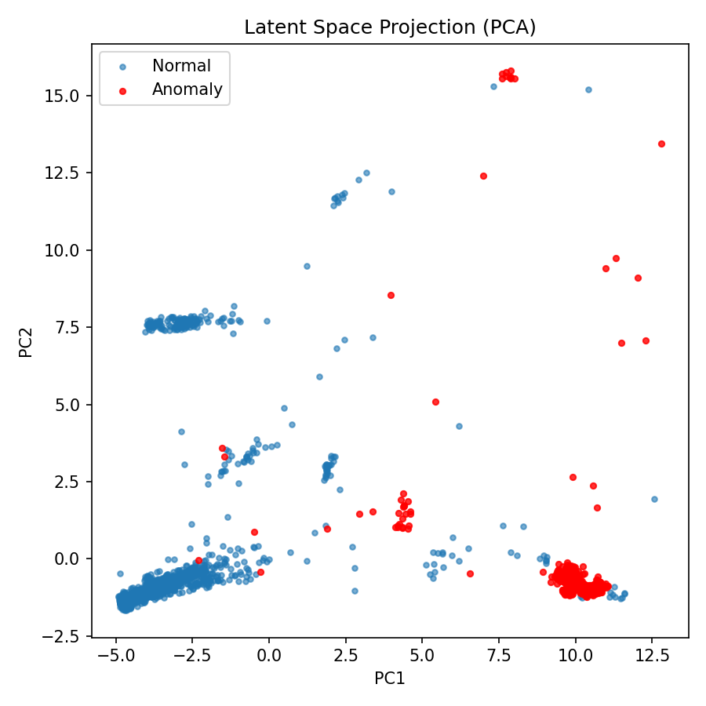
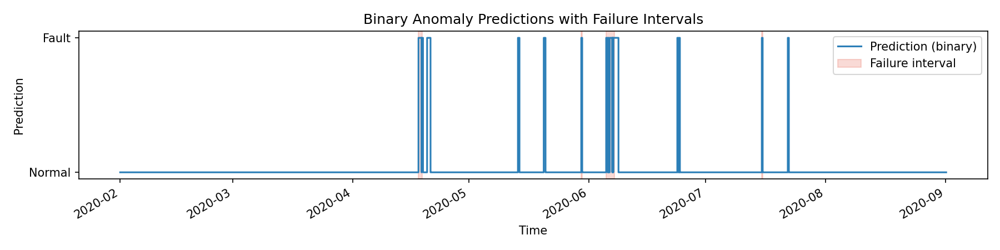
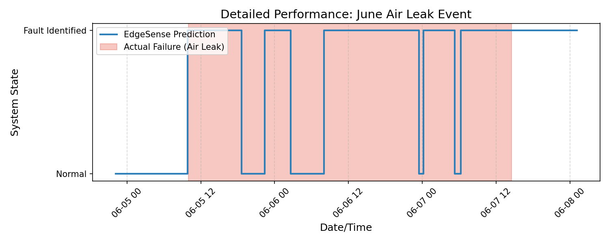

# EdgeSense: Edge-Native Multi-Modal Anomaly Detection

## Executive Summary
EdgeSense is an edge-native artificial intelligence solution designed for real-time predictive maintenance in industrial environments. Traditional monitoring solutions often require streaming massive volumes of sensitive sensor data to the cloud, introducing latency and privacy risks. EdgeSense solves this by localizing both the training and inference phases directly at the machine level. Using an unsupervised adversarial framework, the system learns the unique physical baseline of any industrial asset, enabling it to detect emerging mechanical failures without requiring historically labeled data.

## Strategic Goal
The primary objective is to deliver a plug-and-play engine that can be deployed on resource-constrained hardware (e.g., Industrial IPCs, Jetson Nano). By achieving a perfect recall rate for critical failures and maintaining high precision, EdgeSense enables autonomous, localized intervention, significantly reducing unplanned downtime and maintenance fatigue.

## System Architecture
The core engine is a 1D-Convolutional Neural Network (1D-CNN) implementation of the USAD (Unsupervised Anomaly Detection) framework. This architecture is chosen for its high parallelization potential and low memory footprint compared to traditional recurrent models.

### Adversarial Calibration
The system operates through a two-phase learning cycle:
1. **Physics Baseline:** A shared encoder and dual-decoder setup establishes a mathematical representation of healthy machine operation.
2. **Signal Amplification:** An adversarial minimax game between the decoders amplifies reconstruction errors for data that deviates from the learned baseline, ensuring even subtle mechanical wear is identified.

## Technical Performance
Validated on the Metro.PT (Air Compressor) dataset, the pipeline utilizes macro-context windowing and adversarial weighting to achieve state-of-the-art benchmarks for unsupervised detection:

* **Recall:** 100.0% (Comprehensive detection of all failure events)
* **Precision (Point-Adjusted):** 59.1%
* **ROC-AUC:** 0.9795

### Performance Visualization
The latent space projection confirms the model's ability to compress high-dimensional sensor data into linearly separable clusters of healthy and anomalous states.

The following timeline illustrates the model's binary predictions compared to the labeled failure intervals, demonstrating the 100% recall of critical events.

### High-Resolution Event Analysis
A detailed view of the June Air Leak event (below) demonstrates the model's low-latency detection capabilities, flagging the mechanical shift shortly after the fault interval begins.

## Pipeline Status
- [x] Multi-modal sensor ingestion
- [x] Autonomous healthy-state calibration
- [x] 1D-CNN USAD model implementation
- [x] Adversarial training loop with real-time progress tracking
- [x] Temporal persistence and median-smoothed scoring
- [x] Evaluation and threshold optimization
- [ ] Final edge inference packaging

## Literature & State-of-the-Art (SOTA)
This project is grounded in recent advancements in unsupervised time-series anomaly detection and edge computing:

* **USAD (Unsupervised Anomaly Detection via Adversarial Training):** Audibert et al. (2020) proposed the shared encoder-decoder architecture used for robust training on noisy sensor data.
* **Deep Learning for Time Series Classification:** Fawaz et al. (2019) validated the efficacy of 1D-CNNs for capturing temporal relationships in multivariate datasets without the overhead of LSTMs.
* **Predictive Maintenance in Industry 4.0:** An overview of the shift from cloud-centric to edge-native computing for critical infrastructure.
