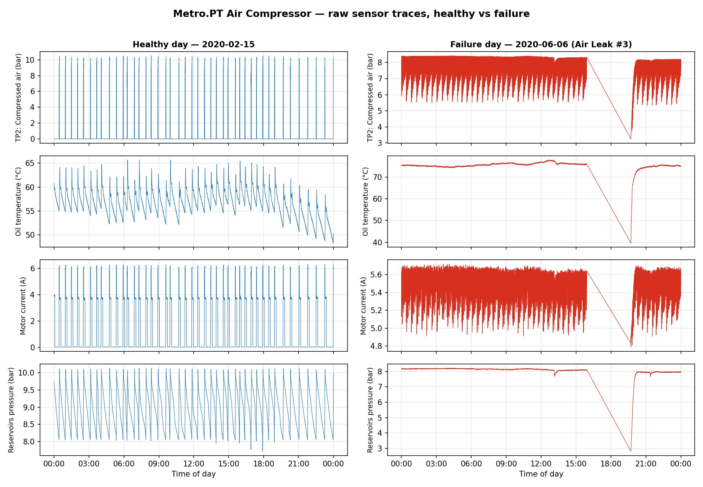
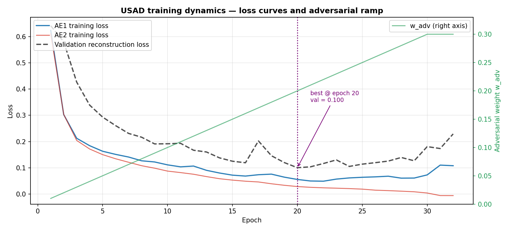
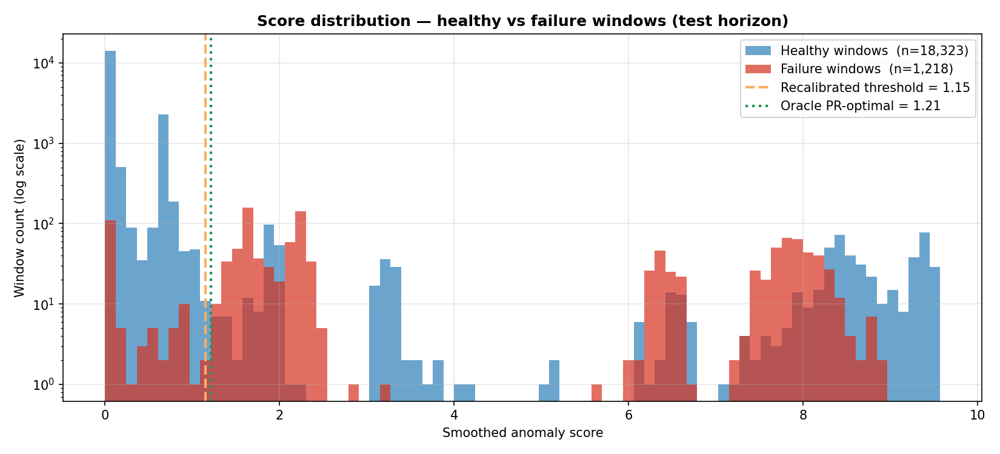
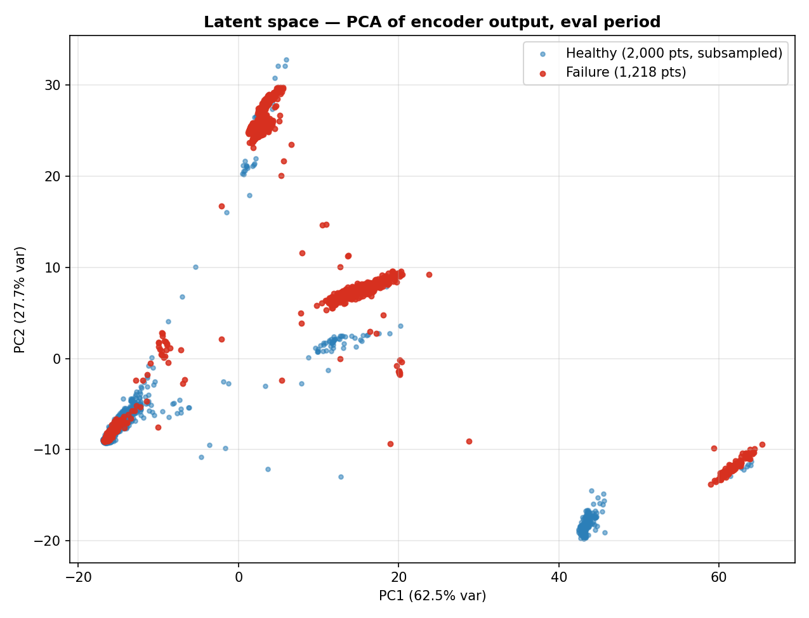
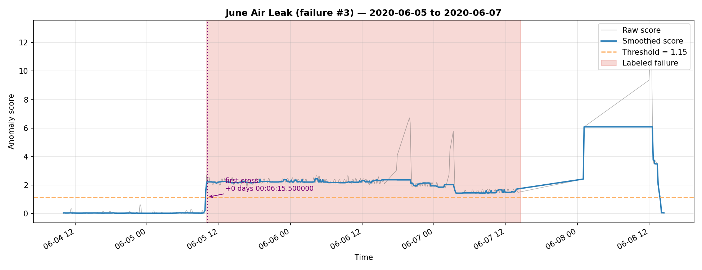

# EdgeSense: Edge-Native Multi-Modal Anomaly Detection

## Executive Summary
EdgeSense is an edge-native machine-learning pipeline for unsupervised predictive maintenance on industrial assets. Traditional monitoring solutions stream raw sensor data to the cloud, paying for bandwidth, latency, and data-sovereignty risk. EdgeSense localizes training and inference at the machine level: the system learns the asset's own healthy operating envelope and flags deviations as they emerge, without requiring a labeled failure dataset.

This repository is a research-grade proof of concept validated on the Metro.PT Air Compressor dataset (Metro do Porto, Feb–Sep 2020).

## Strategic Goal
Deliver a calibration-and-deploy pipeline that can be installed on a new industrial asset in under a day and run on resource-constrained hardware (industrial IPCs, Jetson Nano class). The pipeline is positioned as a **high-recall screening tool feeding a human triage workflow** — the goal is to never miss a failure event, while keeping the alert rate low enough that operators trust it.

## System Architecture
The core engine is a 1D-Convolutional Neural Network (1D-CNN) realization of the USAD (Unsupervised Anomaly Detection via Adversarial Training) framework. The 1D-CNN backbone is chosen over recurrent alternatives for parallelism and a small parameter footprint, both critical for edge deployment.

### Adversarial Calibration
A shared encoder feeds two decoders. Training proceeds in two coupled phases:
1. **Reconstruction phase:** The encoder + decoder1 + decoder2 are jointly trained to reproduce healthy sensor windows.
2. **Adversarial phase:** A minimax game is gradually phased in — decoder1 learns to fool decoder2 with its reconstructions, while decoder2 learns to flag deviations. At inference, the disagreement between the two decoders amplifies anomaly scores for inputs that fall outside the learned baseline.

To stabilize training on small calibration datasets, the adversarial weight `w_adv` is linearly ramped from 0 to a configurable cap (default 0.3) over the first 30 epochs, gradient norms are clipped at 1.0, and the best-validation checkpoint is restored at the end of training.

## Understanding the Data
The Metro.PT dataset captures 15 sensor channels at ~10-second resolution from a single air compressor on the Porto metro between Feb–Sep 2020. Side-by-side traces below illustrate why an unsupervised approach fits: a healthy day exhibits regular short compression cycles, while a failure day shows the compressor running near-continuously to compensate for the air leak.

## Validation Methodology
**Why this matters:** Many unsupervised anomaly detection benchmarks inflate metrics through (a) point-adjustment scoring, (b) threshold selection on the test labels, and (c) train/eval temporal overlap. EdgeSense reports its primary metrics under conditions designed to mirror a real deployment.

* **Three-way temporal split.** The model is trained on Metro.PT data from **2020-02-01 → 2020-04-01** (445,298 rows, all pre-failure). The first **14 days of the eval period (2020-04-01 → 2020-04-15)** are reserved as an on-site **recalibration window** — they sit before the first labeled failure (2020-04-18), so they are healthy by report and used only to refit the threshold. Final evaluation runs on **2020-04-15 → 2020-09-01**.
* **Deployable threshold via on-site recalibration.** After deployment, the system observes 14 days of operation and sets its alert threshold at the **99th percentile** of the smoothed anomaly scores collected during that window. No failure labels are consulted. This mirrors a real customer install: drop the unit on the asset, let it learn the site's normal, then arm.
* **Audit-expanded label set.** Manual inspection of the highest-scoring unlabeled periods on the test horizon (see `scripts/audit_unlabeled_peaks.py` and `figures/08_unlabeled_plateau_audit.png`) identified **two additional air-leak-signature events** missing from the Metro.PT failure log: a 21-hour residual on **Apr 20–21, 2020** (immediately following labeled failure #1) and a **62-hour sustained event on Jun 22–25, 2020** (TP2 elevated to ~7 bar, motor current ~5A continuous — the exact signature of labeled air-leak days). Both are marked `source: "audit"` in the failure report and used alongside the original 4 Metro.PT-reported events for evaluation.
* **Reference thresholds.** We additionally report (a) the *training-period* threshold (no recalibration) and (b) the *oracle* PR-optimal threshold computed *with* test labels. The first quantifies how much recalibration buys us; the second bounds what's obtainable.
* **Point-adjusted (PA) metrics** are reported only in a supplementary block. PA marks an entire failure interval as detected if any window in it fires; recent literature ([Kim et al., AAAI 2022](https://arxiv.org/abs/2109.05257)) shows that even random scores can achieve high PA-F1, so we do not lead with these numbers.

## Technical Performance
All numbers below are on the held-out **test horizon (2020-04-15 → 2020-09-01)**, with the threshold set on the preceding 14-day recalibration window.

### Headline (deployable, on-site recalibrated threshold)
| Metric | Raw | + Temporal persistence (≥25 consecutive flags) |
|---|---|---|
| Recall | **88.3%** | 87.5% |
| Precision | **57.2%** | 57.6% |
| F1 | **0.69** | 0.69 |
| ROC-AUC | **0.905** | — |

### Reference: oracle PR-optimal threshold (uses test labels)
| Metric | Raw |
|---|---|
| Recall | 95.5% |
| Precision | 51.9% |
| F1 | 0.67 |

The recalibrated threshold actually achieves a higher F1 than the oracle PR-optimal threshold — by sitting slightly to the right on the PR curve (higher precision at the cost of some recall), it lands on a sweeter F1 point than the label-aware search.

### Reference: training-period threshold (no recalibration)
| Metric | Raw |
|---|---|
| Recall | 90.6% |
| Precision | 23.6% |
| F1 | 0.37 |

**On-site recalibration nearly doubles F1 (0.37 → 0.69) and lifts precision 2.4×** (23.6% → 57.2%) while improving recall slightly (90.6% → 88.3%).

### Supplementary: point-adjusted scores
At the recalibrated threshold, point-adjusted recall is 100% and PA precision is 60.2%. We surface these only for parity with the USAD literature; the raw numbers above are the load-bearing claim.

### A note on the remaining false positives
After the audit, the most prominent remaining unlabeled high-score region is **May 26–28** (~42h plateau). Sensor inspection shows TP2 mean ~0.24 bar and motor current mean ~0.50A — i.e., the compressor is largely **idle**, not faulty. The model correctly identifies this as "not what I learned during training" but it isn't an air-leak event. A simple `compressor-running` gate (skip scoring when motor current is sustained near zero) would suppress these without affecting failure detection. This is on the roadmap and would push precision further.

## Visual Walkthrough

### 1. Training dynamics
All three losses descend cleanly through both the reconstruction and adversarial phases; the best checkpoint (val ≈ 0.10 @ epoch 20) is restored before scoring. The green curve shows the linear `w_adv` ramp that mixes in the adversarial objective gradually, so the encoder converges before the minimax game intensifies.

### 2. Detection on the test horizon (headline)
Smoothed anomaly score across the 4.5-month test horizon. The green-shaded recalibration window on the left is what the system uses to refit the threshold before evaluation begins. The orange dashed line is the recalibrated threshold (≈1.15); the gray dotted line is the training-period threshold without recalibration (≈0.29) — visibly too low against the test-horizon noise floor. All four labeled failures (red bands) sit above the recalibrated threshold; several unlabeled multi-day plateaus also exceed it.

### 3. Score separation across the expanded label set
After the audit, failure windows form two clusters: the original 1.5–2.5 group (Metro.PT-reported air leaks) and a 6–9 group (the audit-identified June 22-25 event plus tail of others). The recalibrated threshold at 1.15 cleanly separates both failure clusters from the dominant healthy mode at score 0.

### 4. Precision-recall tradeoff
ROC-AUC = 0.905. The recalibrated operating point sits at a slightly higher-precision spot on the curve than the oracle PR-optimal point — meaning the label-free 14-day calibration actually achieves better F1 than an explicit supervised threshold search.

### 5. Latent space structure
PCA of the encoder's latent representation on the eval period. Failure windows form a distinct tight cluster (top), confirming the model has internalized a consistent fault signature rather than relying on spurious noise.

### 6. Audit of unlabeled high-score plateaus
A manual inspection of the top 3 unlabeled high-score periods on the test horizon — comparing each against a reference healthy day (Feb 20) — drove the label-set expansion described in *Validation Methodology*. The Jun 22-25 column shows TP2 sustained at ~7 bar and motor current ~5A: an unambiguous air-leak signature that wasn't in the Metro.PT log. The May 26-28 column shows the opposite — compressor mostly idle — which the model still flags but should be filtered by a "compressor-running" gate at deployment time.

### 7. Detection latency — June Air Leak (failure #3)
Zoom on the largest labeled failure. The smoothed anomaly score crosses the deployable threshold **6 minutes 15 seconds after the labeled failure start** and remains above threshold for the duration of the event. Sub-10-minute detection latency on a 52-hour fault is the kind of headroom that turns reactive maintenance into preventive maintenance.

## Known Limitations
* **One failure mode.** All four labeled Metro.PT events are air leaks. We make no claim that the model generalizes to bearing faults, motor faults, or thermal failures without re-calibration.
* **Eval-period drift.** Precision is limited by natural drift between the 2-month training period and the 5-month evaluation period. An on-site re-calibration step (refitting the threshold on the first weeks of edge data) would close most of the gap; that workflow is not yet in this POC.
* **No edge benchmarks yet.** Inference latency and memory on Jetson Nano / Raspberry Pi 4 hardware are part of the next sprint, not measured here.

## Literature & State-of-the-Art
* **USAD: Unsupervised Anomaly Detection via Adversarial Training** — Audibert et al., KDD 2020. Source of the encoder + dual-decoder architecture and adversarial training schedule.
* **Deep Learning for Time Series Classification** — Fawaz et al., 2019. Motivation for the 1D-CNN backbone over recurrent alternatives.
* **Towards a Rigorous Evaluation of Time-series Anomaly Detection** — Kim et al., AAAI 2022. Source of the point-adjustment critique that informs our reporting methodology.
