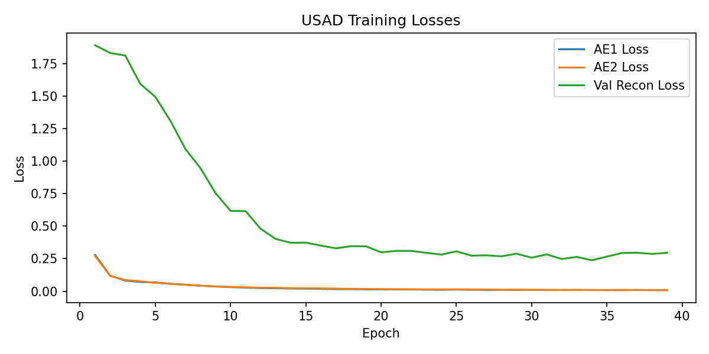
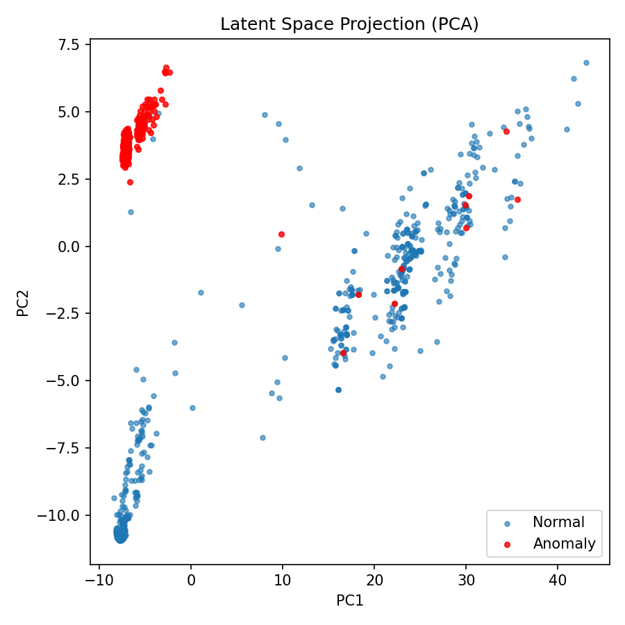

# EdgeSense: Edge-Native Multi-Modal Anomaly Detection

This project bridges low-level industrial data streams and high-level artificial intelligence to provide a localized, plug-and-play predictive maintenance solution. It is designed to learn the baseline physics of complex machinery directly on the edge, without requiring cloud connectivity or labeled failure data.

---

## The Problem

Modern industrial predictive maintenance solutions suffer from three critical bottlenecks:
1. **Data Privacy & Latency:** Streaming terabytes of high-frequency sensor data (vibration, current, pressure) to the cloud exposes proprietary factory operations and introduces network latency.
2. **The "Data Science" Friction:** Most models require supervised training, meaning data scientists must manually label thousands of hours of data to teach a model what a "failure" looks like.
3. **Concept Drift:** As machines naturally age (e.g., belts stretch, gears wear), their baseline operational data shifts. Static cloud models quickly become obsolete, triggering false positive alarms.

## The Solution

NeuroEdge flips the paradigm by bringing the training phase directly to the machine. 

Using an unsupervised **Variational Autoencoder (VAE)** running on an edge device (e.g., an industrial IPC or Jetson Nano), the system interfaces with standard factory protocols like OPC UA or PROFINET. Upon installation, it listens to the multi-modal data streams during a designated "calibration period." It encodes the healthy state of the machine into a lower-dimensional latent space. 

When a mechanical fault begins to develop, the sensor data shifts. The Autoencoder fails to reconstruct this unfamiliar data, causing the Mean Squared Error (MSE) to spike:

$$\\mathcal{L} = \\frac{1}{N} \\sum_{i=1}^{N} (x_i - \\hat{x}_i)^2$$

Once $\\mathcal{L}$ crosses an autonomously calculated threshold, the system flags an anomaly. 

## What We Are Building (Summer POC Scope)

To validate the core mathematical and architectural concepts, this repository contains a simulated pipeline built in Python and PyTorch.

1. **Multi-Modal Data Simulation:** Using the Metro.PT (Air Compressor) dataset, we simulate a live industrial data stream. A publisher script broadcasts multivariate time-series data (current, pressure, temperature) over a local network mimicking an industrial fieldbus.
2. **The 1D-CNN Autoencoder:** A PyTorch-based Convolutional Neural Network designed to handle overlapping time-windows of sensor data, capturing both temporal dynamics and cross-sensor correlations.
3. **Continuous Inference:** A real-time listener node that ingests the live stream, passes it through the trained Autoencoder, and visualizes the reconstruction error dynamically in the terminal.

## 🧠 Architecture

## 📈 Training Diagnostics

## ✅ TODO (POC Pipeline)

- [x] Ingest Metro.PT dataset
- [x] Build preprocessing pipeline (scaling, missing values)
- [x] Create sliding windows
- [x] Implement 1D-CNN USAD model
- [x] Implement USAD training loop
- [x] Define anomaly scoring & thresholding
- [x] Evaluate on anomaly segments
- [ ] Package edge inference pipeline

## Literature & State-of-the-Art (SOTA)

This project is grounded in recent advancements in unsupervised time-series anomaly detection and edge computing:

* **USAD (Unsupervised Anomaly Detection via Adversarial Training):** Audibert et al. (2020) proposed a novel architecture combining autoencoders with adversarial training, providing fast, robust training suitable for edge devices. This project takes architectural inspiration from their encoder-decoder approach to handle sensor noise. [Read Paper](https://dl.acm.org/doi/10.1145/3394486.3403392)
* **Deep Learning for Time Series Classification and Clustering:** Fawaz et al. (2019) outline the efficacy of 1D-CNNs for capturing temporal relationships in multivariate datasets without the computational overhead of recurrent networks (LSTMs). [Read Paper](https://arxiv.org/abs/1809.04356)
* **Predictive Maintenance in Industry 4.0:** An overview of the shift from cloud-centric to edge-native computing for critical industrial infrastructure, emphasizing the necessity of protocol-agnostic data ingestion (OPC UA).
* **Concept Drift in Machine Learning:** Addressing the challenge of adapting models over time as the physical dynamics of the monitored system naturally degrade.
