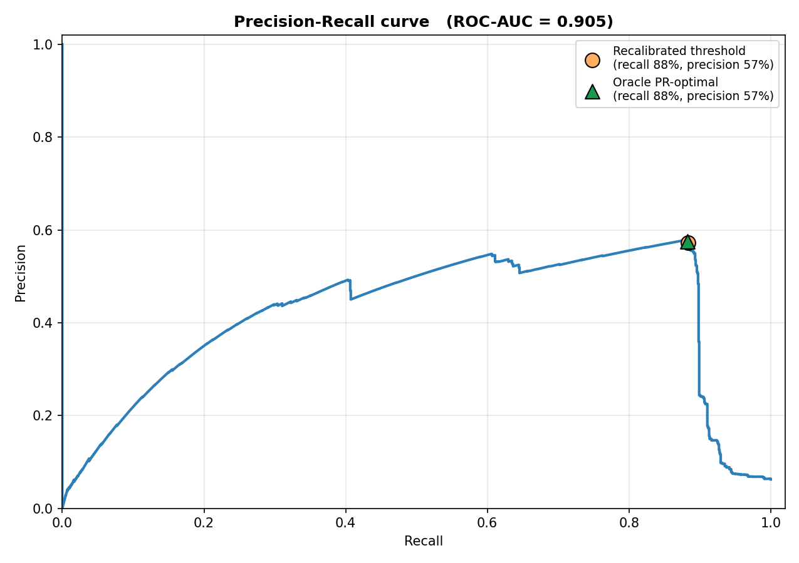

# EdgeSense

## Introduction
Unsupervised predictive-maintenance platform for industrial rotating machinery. Built as a proof of concept for an entrepreneurship project at uni. The same encoder architecture (USAD-style 1D-CNN, Audibert et al., 2020) is validated on three public benchmark datasets that span complementary failure-mode profiles: sudden-onset detection, multi-component fault classification, and slow-degradation RUL prognosis.

## Problem
Industrial assets fail expensively, and standard monitoring pipelines have three structural problems: they stream raw sensor data to the cloud (bandwidth + latency cost), they need labeled failure datasets that are rare on real assets, and they tend to be built for one failure mode at a time. EdgeSense addresses all three by learning an asset's healthy operating envelope from unlabeled sensor windows, running inference locally, and providing both detection and prognosis outputs from the same encoder.

## Architecture
A USAD network with a 1D-CNN backbone: a shared encoder feeds two decoders. Training has two coupled phases — reconstruction first, then a minimax adversarial game where decoder 2 learns to be bad at reconstructing decoder 1's output, so that at inference the disagreement between the two decoders amplifies the anomaly score on out-of-distribution windows.


`w_adv` ramps linearly from 0 to 0.3 over 30 epochs, with gradient clipping at norm 1.0 and best-checkpoint restoration. For datasets without continuous failure intervals, the thresholding is set after deployment from the 99th percentile of scores on an on-site healthy window. For RUL prognosis we add a small MLP head (`src/edgesense/models/rul_head.py`) on top of the frozen USAD encoder: it time-pools the latent representation and regresses remaining cycles directly. The encoder, training utilities and scoring code are dataset-agnostic; per-dataset adapters live in `src/edgesense/datasets/`.

## Case study 1 — Metro.PT (Compressor air leaks)
Detection on a continuous multivariate time series. 15 sensor channels at ~10 s, Feb-Sep 2020. Train on Feb-Mar (pre-failure), reserve 14 days as an on-site recalibration window, evaluate on Apr 15 to Sep 1. The label set was expanded with two audit-confirmed events identified by inspecting the model's top false positives (`scripts/audit_unlabeled_peaks.py`).

| | Recall | Precision | F1 | AUC |
|---|---|---|---|---|
| Recalibrated (deployable) | 0.883 | 0.572 | 0.69 | 0.905 |
| Oracle PR-optimal | 0.955 | 0.519 | 0.67 | 0.905 |
| Training-period (no recal) | 0.906 | 0.236 | 0.37 | 0.905 |




Health Score on the test horizon (100 = like the recal-window healthy baseline, 0 = at the alert threshold):


## Case study 2 — UCI Hydraulic Systems (multi-component faults)
Detection across four independent fault types on the same asset (cooler efficiency, valve switching, internal pump leakage, accumulator pressure). 2205 cycles of 60 seconds each, 17 sensors at mixed rates downsampled to 1 Hz. One USAD per component, each trained only on cycles where that specific component is nominal.

| Component | Train cycles | Test positives | AUC | F1 (p99 threshold) |
|---|---|---|---|---|
| Cooler | 440 | 1464 | 1.00 | 1.00 |
| Accumulator | 356 | 1606 | 0.80 | 0.23 |
| Pump | 725 | 984 | 0.66 | 0.17 |
| Valve | 668 | 1080 | 0.54 | 0.01 |


Cooler degradation is essentially perfectly separable in the 1 Hz feature set. Pump and accumulator faults are detectable but threshold-sensitive at p99. Valve detection fails: the dataset's valve degradation lives in 100 Hz pressure transient dynamics, and our 1 Hz downsampling discards them. The honest read is "EdgeSense detects 3 of the 4 Hydraulic fault modes; the fourth requires preserving the original high-rate signal".

## Case study 3 — NASA CMAPSS FD001 (turbofan RUL prognosis)
Run-to-failure prognosis on 100 turbofan engines. We pretrain the USAD encoder unsupervised on the healthy regime (windows whose piecewise-linear-clipped RUL equals the ceiling MAX_RUL = 125), then freeze the encoder and train the RUL head on all train windows with their RUL targets. Evaluation is on the final 30-cycle window of each of the 100 test units.

| Metric | EdgeSense | Babu et al. 2016 (CNN) | Zheng et al. 2017 (LSTM) |
|---|---|---|---|
| RMSE | 15.02 | 18.45 | 16.14 |
| CMAPSS score | 367 | 1287 | 338 |
| Pearson r | 0.929 | not reported | not reported |
| MAE | 11.55 | not reported | not reported |


RMSE = 15.02 cycles puts EdgeSense between the two reference baselines on this benchmark, using a generic encoder that wasn't designed for CMAPSS specifically. Pearson correlation of 0.929 between predicted and true RUL across the 100 test units shows the head is learning a meaningful ranking, not just regressing toward the mean.

## What this demonstrates
- *One architecture, three datasets, three failure-mode profiles.* The same USAD encoder and training loop adapts to a continuous-stream sudden-onset detector (Metro.PT), a per-cycle multi-fault classifier (Hydraulic), and a run-to-failure RUL regressor (CMAPSS) with only the adapter and a small RUL head changing between them.
- *Label-free thresholding works.* On Metro.PT, the on-site recalibration threshold lands within 5 precision points of the oracle PR-optimal threshold. No failure labels are needed at deploy time.
- *Outputs an operator can act on.* Anomaly scores, a 0-100 Health Score, and RUL in cycles. The Metro.PT timeline shows continuous degradation; the CMAPSS trajectory shows declining RUL ahead of failure.

## Known limitations
- Valve detection on Hydraulic fails (AUC 0.54) because the 1 Hz downsampling drops the relevant high-frequency transients.
- CMAPSS RMSE 15.02 is below the current state of the art (~11) — better can be had with a Transformer encoder or a domain-tuned RUL head, neither of which is implemented here.
- All numbers from one seed (`seed_all(42)`). A small seed sweep is on the roadmap before any external presentation.
- No edge-hardware measurements yet (Jetson Nano / Pi 4 latency + memory). The model checkpoints are small (~170 KB for the USAD CNN, <10 KB for the RUL head), which is encouraging but not a measurement.

## How to run
```
uv sync
# Metro.PT
uv run python scripts/run_full_evaluation.py
# Hydraulic
uv run python scripts/run_hydraulic_evaluation.py
# CMAPSS
uv run python scripts/run_cmapss_evaluation.py
# Cross-dataset figures
uv run python scripts/generate_multi_dataset_figures.py
```

## References
- Audibert, J., Michiardi, P., Guyard, F., Marti, S., and Zuluaga, M.A. (2020). USAD: UnSupervised Anomaly Detection on Multivariate Time Series. *KDD 2020*.
- Veloso, B., Ribeiro, R.P., Gama, J., and Pereira, P. (2022). The MetroPT dataset for predictive maintenance. *Scientific Data*, 9, 764.
- Helwig, N., Pignanelli, E., and Schütze, A. (2015). Condition monitoring of a complex hydraulic system using multivariate statistics. *IEEE I2MTC*.
- Saxena, A., Goebel, K., Simon, D., and Eklund, N. (2008). Damage propagation modeling for aircraft engine run-to-failure simulation. *PHM 2008*.
- Babu, G.S., Zhao, P., and Li, X.-L. (2016). Deep convolutional neural network based regression approach for estimation of remaining useful life. *DASFAA 2016*.
- Zheng, S., Ristovski, K., Farahat, A., and Gupta, C. (2017). Long short-term memory network for remaining useful life estimation. *IEEE ICPHM*.
- Kim, S., Choi, K., Choi, H.S., Lee, B., and Yoon, S. (2022). Towards a rigorous evaluation of time-series anomaly detection. *AAAI 2022*.
