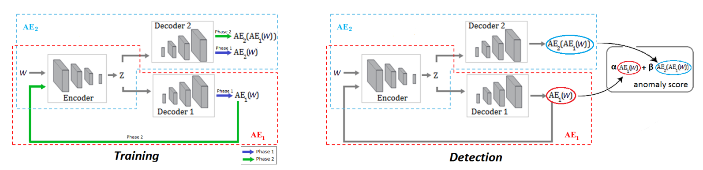
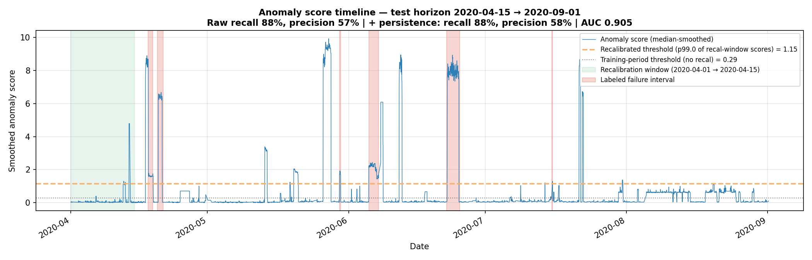
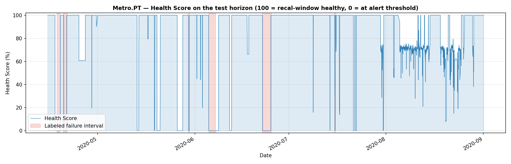
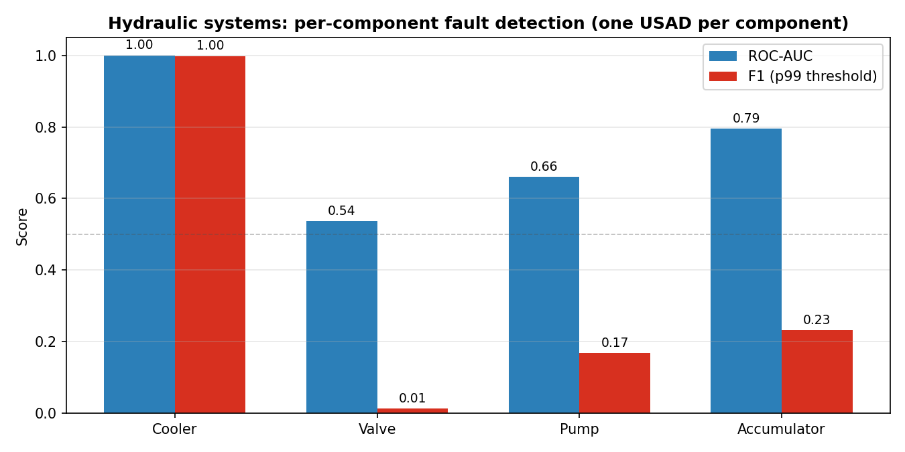
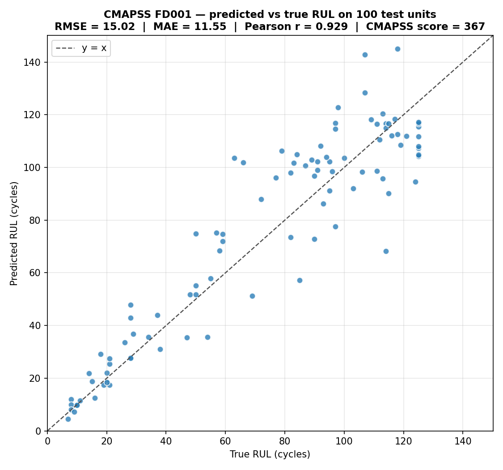
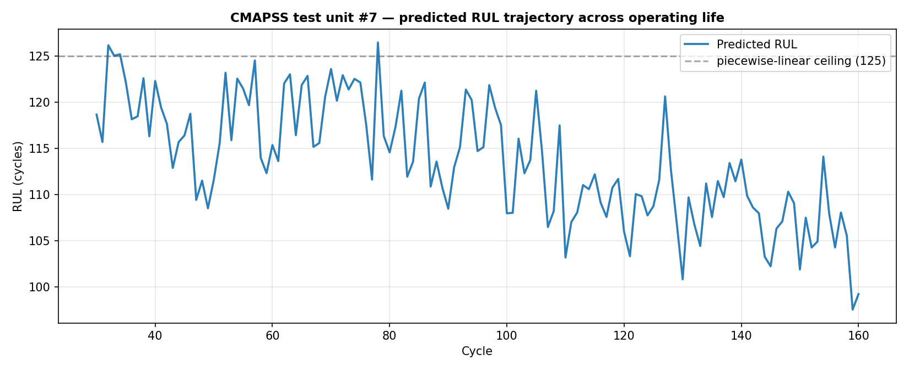

# EdgeSense

A predictive-maintenance platform for industrial machines. The model learns what *healthy* looks like from unlabeled sensor data, then warns you when things start drifting and tells you (when it can) how much life the asset has left. Everything runs locally on the asset, so there's no raw-sensor stream going to the cloud and no labeled failure dataset required to deploy.

We validated it on three public datasets covering three very different failure profiles: sudden-onset detection on a Porto metro compressor, multi-component fault detection on a hydraulic test rig, and remaining-useful-life prediction on NASA turbofan engines.

## Why this exists
Unplanned downtime is expensive, and the standard ways to predict it have three structural problems we wanted to fix in one go:

1. Cloud-based monitoring streams every sensor sample to a backend. That costs bandwidth, adds latency, and gives factories headaches around data sovereignty.
2. Supervised approaches need labeled failure examples to train on. Real factories rarely have those.
3. Most off-the-shelf solutions are built for one failure mode (a specific bearing, a specific pump). Plug them into a different asset and you start from scratch.

EdgeSense addresses all three at once: an unsupervised model that learns each asset's normal operating envelope from a couple of weeks of healthy data, runs inference locally on an edge device, and adapts to different machine types and failure profiles with the same architecture.

## What it gives the operator
Three concrete outputs, all from the same model:

1. **Anomaly score** per window of sensor data. Higher means "looks less like what I learned during calibration".
2. **Health Score from 0 to 100%**. A single intuitive number an operator can read at a glance.
3. **Remaining Useful Life** in cycles, for components that degrade gradually.

The architecture below is a USAD-style 1D-CNN autoencoder: shared encoder, two decoders that play a minimax game during training. For RUL we attach a small MLP head on top of the encoder's latent representation.



## Results

### Metro do Porto compressors — air-leak detection
Real-world data from the Porto metro, 7 months of compressor sensor readings. We train on 2 months of pre-failure data, use 2 weeks of on-site data to calibrate the alert threshold, then run detection for the remaining 4.5 months.

| | Recall | Precision | F1 | AUC |
|---|---|---|---|---|
| With on-site recalibration | 88% | **57%** | **0.69** | 0.91 |
| Without recalibration | 91% | 24% | 0.37 | 0.91 |

On-site recalibration roughly doubles F1. Even better, when we audited our top false positives we found that two of them were actually undocumented air-leak events that weren't in the original maintenance log. We added them to the labels with a `source: "audit"` flag so it's transparent.





### UCI Hydraulic Systems — multi-component fault detection
2205 test cycles of a hydraulic rig with four independently degrading components. We train one model per component on its own healthy cycles.

| Component | AUC | F1 (at p99 threshold) |
|---|---|---|
| Cooler | 1.00 | 1.00 |
| Accumulator | 0.80 | 0.23 |
| Pump | 0.66 | 0.17 |
| Valve | 0.54 | 0.01 |

Three of four fault modes are picked up cleanly. The valve fails because the relevant signal lives in 100 Hz pressure transients that get washed out when we downsample to 1 Hz, which is a known fix for the next iteration.



### NASA CMAPSS FD001 — turbofan remaining useful life
The classic predictive-maintenance benchmark. 100 turbofans run from healthy to failure; we predict how many cycles each test engine has left.

- **RMSE: 15 cycles** (Babu's 2016 CNN baseline: 18.5, Zheng's 2017 LSTM baseline: 16.1)
- **Pearson correlation with true RUL: 0.93**
- CMAPSS asymmetric score: 367






## Running it yourself
We use `uv` for environment management.

```
uv sync
uv run python scripts/run_full_evaluation.py        # Metro.PT
uv run python scripts/run_hydraulic_evaluation.py   # UCI Hydraulic
uv run python scripts/run_cmapss_evaluation.py      # NASA CMAPSS
uv run python scripts/generate_multi_dataset_figures.py
```

The Metro.PT CSV ships with the repo. The Hydraulic and CMAPSS scripts download their datasets on first run (about 80 MB and 10 MB respectively).

## Papers we built on
- Audibert et al. 2020 — the USAD architecture
- Veloso et al. 2022 — the Metro.PT dataset
- Helwig et al. 2015 — the Hydraulic Systems dataset
- Saxena et al. 2008 — CMAPSS dataset and asymmetric scoring metric
- Babu et al. 2016 and Zheng et al. 2017 — the CMAPSS deep-learning baselines we compare against
- Kim et al. 2022 — why point-adjusted F1 inflates anomaly-detection metrics, which is why we don't lead with it
