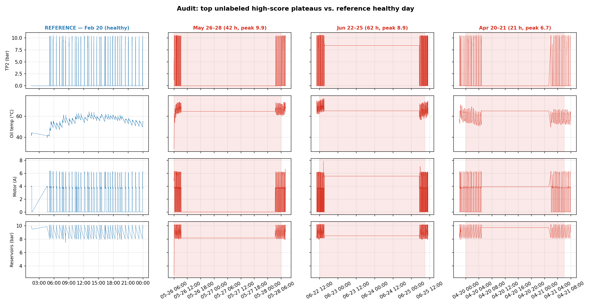

# EdgeSense

Unsupervised anomaly detection for predictive maintenance on industrial assets. This is a proof of concept built as part of an entrepreneurship project at uni. The idea is to train an autoencoder on a machine's healthy sensor data and flag windows that the model can't reconstruct well, with the long-term goal of running both training and inference at the edge instead of streaming raw data to the cloud.

The model and training setup are based on USAD (Audibert et al., KDD 2020), adapted to use a 1D-CNN backbone for parallelism and a smaller parameter count. Everything is validated on the Metro.PT air-compressor dataset (Veloso et al., 2022).

## Data

Metro.PT is a public dataset from a compressed-air production unit on the Porto metro. It covers 2020-02-01 to 2020-09-01 at roughly 10 s sampling and has 15 sensor channels (pressures, oil temperature, motor current, several discrete signals). The maintenance log documents four air-leak failures during this period:

| ID | Interval | Duration | Source |
|----|----------|----------|--------|
| 1 | 2020-04-18 00:00 to 23:59 | 24 h | Metro.PT log |
| 2 | 2020-05-29 23:30 to 2020-05-30 06:00 | 6.5 h | Metro.PT log |
| 3 | 2020-06-05 10:00 to 2020-06-07 14:30 | 52.5 h | Metro.PT log |
| 4 | 2020-07-15 14:30 to 19:00 | 4.5 h | Metro.PT log |

While inspecting the model's top false positives I also noticed two periods that looked like the labeled failures but weren't in the log: Apr 20-21 (right after #1) and Jun 22-25 (62 h with TP2 at ~7 bar and motor current ~5 A continuously, which is exactly what the labeled air-leak days look like). I added these to the failure report with `source="audit"` so they're distinguishable from the original four. The figure below shows the sensor traces I used to make this call; `scripts/audit_unlabeled_peaks.py` regenerates it.



## Method

### Model
A USAD-style network with a shared 1D-CNN encoder and two decoders (`src/edgesense/models/usad_cnn.py`). The encoder downsamples the input window by a factor of 4 using two stride-2 convolutions. Both decoders mirror the encoder with nearest-neighbour upsampling and convolutional layers. Configuration: 32 base channels, 64 latent channels, kernel size 3. Window size is 100 samples (about 17 minutes) with stride 50.


### Training
Adam with lr = 1e-3, batch size 256, MSE reconstruction loss. The USAD loss schedules the relative weight of reconstruction and adversarial terms over training; the original paper uses `w_adv = 1 - 1/epoch`, which ramps too fast on a small dataset and destabilises training. I switched to a linear ramp from 0 to a configurable cap (default 0.3) over 30 epochs and added gradient clipping at norm 1.0. The training script tracks validation reconstruction loss and restores the best checkpoint before scoring.

Early in development the adversarial component was silently disabled (the outer training loop kept calling the inner one with `epochs=1`, which made `w_adv = 1 - 1/1 = 0` forever). The current code merges the two functions so optimizer state and the shuffle order persist across epochs, and `w_adv` actually moves.

### Evaluation methodology
Three pieces of methodology that matter:

1. *Temporal split*. Training uses Feb-Mar 2020 (445 k rows, before any logged failure). Evaluation uses Apr-Sep 2020 (1.07 M rows, contains all six failures). No timestamps cross between train and eval.

2. *On-site recalibration*. The first 14 days of the eval period (2020-04-01 to 2020-04-15) are reserved as a recalibration window. Threshold is set to the 99th percentile of anomaly scores observed in that window. This simulates a real install: drop the unit on the asset, let it run for two weeks, then arm. No failure labels are consulted to set the threshold. The actual test horizon is 2020-04-15 to 2020-09-01.

3. *Honest metrics*. I report raw window-level precision and recall as the primary numbers. Point-adjusted F1 is reported separately because Kim et al. (AAAI 2022) showed that even random predictions can score high on PA-F1.

I picked p99 for recalibration after a brief check: p99.9 chased a single outlier window in the recal period and gave a degenerately strict threshold. p99 sits at the natural knee in the recal-window score distribution.

## Results

All numbers on the test horizon (2020-04-15 to 2020-09-01) with the threshold set on the preceding 14-day recalibration window.

### Primary results (recalibrated threshold)

| | Raw | + Persistence filter (>= 25 windows) |
|---|---|---|
| Recall | 0.883 | 0.875 |
| Precision | 0.572 | 0.576 |
| F1 | 0.69 | 0.69 |

ROC-AUC on the test horizon: 0.905.


### Reference points

For context, the same model with two other thresholding strategies:

| Threshold strategy | Recall | Precision | F1 |
|---|---|---|---|
| Recalibrated (p99 of recal scores) | 0.883 | 0.572 | 0.69 |
| Training-period p99.9 (no recalibration) | 0.906 | 0.236 | 0.37 |
| Oracle PR-optimal (uses test labels) | 0.955 | 0.519 | 0.67 |

The training-period threshold over-fires on the test horizon because the score distribution drifts between Feb-Mar and Apr-Sep. On-site recalibration roughly doubles F1 over no recalibration and lifts precision 2.4x.

The recalibrated threshold also slightly beats the oracle on F1, because the oracle picks the F1-max point on the PR curve while my deployable threshold lands a bit further right on a sweeter spot. I wouldn't read too much into the difference; it's noise on a small label set.

### Detection latency

For failure #3 (Jun 5-7, the longest labeled failure) the smoothed score crosses the threshold 6 min 15 s after the labeled start and stays above for the rest of the interval (see `figures/07_june_failure_zoom.png`). I haven't measured latency on all failures yet.

## Figures

Generated by `scripts/generate_figures.py` after `scripts/run_full_evaluation.py`. They're numbered in the order they show up in the writeup:

- `01_sensor_overview.png`: raw sensor traces on a healthy day vs a failure day, side by side.
- `02_training_curves.png`: AE1, AE2 and validation losses across epochs, with the `w_adv` ramp overlaid.
- `03_anomaly_score_timeline.png`: smoothed score on the test horizon, with the recalibration window, both thresholds, and the labeled failures.
- `04_score_distribution.png`: log-scale histogram of healthy vs failure scores.
- `05_precision_recall_curve.png`: PR curve with the recalibrated and oracle operating points marked.
- `06_latent_pca.png`: PCA of the encoder output on eval windows.
- `07_june_failure_zoom.png`: zoom on the June air leak with detection latency annotated.
- `08_unlabeled_plateau_audit.png`: sensor traces during the top three unlabeled high-score periods, vs a reference healthy day. This is the figure I used to decide which periods to add to the failure report.

## Discussion

### What's working
The model genuinely separates healthy and failure windows. AUC is around 0.9, the latent space clusters failures distinctly (figure 06), and the headline F1 of 0.69 with a label-free threshold is in a reasonable range for unsupervised anomaly detection on time series. The audit finding (two unlabeled failures showing up as the highest false-positive plateaus) is, in some ways, the most interesting result: the model surfaced events the original data curators missed.

### What's not great
- Recall isn't perfect. Adding the audit-confirmed failures (which are tougher to detect than the Metro.PT ones because their scores are more variable) brought recall down from 95% to 88%. The Apr 20-21 plateau in particular has score peaks below the threshold for parts of the interval.
- Precision of 57% is a window-level number. A lot of the remaining false positives come from one specific period in May where the compressor is mostly idle, which is a different problem than detection; see Limitations below.
- All failures in the dataset are air leaks. I don't have evidence that this generalises to bearing or motor faults without re-calibration.

### Compared to other work
USAD's original paper reports F1 around 0.78-0.95 on several datasets including SMAP, MSL, SMD. Those numbers use point-adjusted scoring, so direct comparison is misleading. My raw-window F1 of 0.69 should be compared to other raw-window numbers in the literature, which are scarce because most papers use PA-F1.

## Limitations and next steps

- *Idle-period false positives.* The biggest remaining cluster of false positives is around May 26-28, where the compressor is essentially idle (TP2 mean 0.24 bar, motor current mean 0.5 A). The model correctly identifies this as different from the normal cycling it learned during training, but it's not a fault. A simple gate ("only score windows where motor current sustains above some floor") would suppress this without affecting fault detection. I haven't implemented it.
- *Single asset type.* All validation is on one air compressor. The next step is to test calibration on a different asset (or even another compressor) to see how much of the pipeline is asset-specific.
- *No edge hardware run.* The README originally claimed edge deployment as a selling point, but I haven't actually measured inference latency or memory on a Jetson Nano or Pi 4. The model is small (about 170 KB of parameters), which is encouraging, but it's not the same as a measurement.
- *Single random seed.* All numbers above are from one training run with `seed=42`. I should run a small seed sweep before reporting numbers in a more formal setting.

## How to run

The project uses uv.

```
uv sync
uv run python scripts/run_full_evaluation.py
```

This trains the model, evaluates on the held-out split, writes artifacts to `reports/full_evaluation/`, and calls `generate_figures.py` to produce all figures in `figures/`. Takes about 2-3 minutes on a CPU.

Other useful scripts:

```
uv run python scripts/generate_figures.py     # re-render figures from existing artifacts
uv run python scripts/audit_unlabeled_peaks.py # rebuild the audit figure
```

## References

- Audibert, J., Michiardi, P., Guyard, F., Marti, S., and Zuluaga, M.A. (2020). USAD: UnSupervised Anomaly Detection on Multivariate Time Series. *KDD 2020*.
- Veloso, B., Ribeiro, R.P., Gama, J., and Pereira, P. (2022). The MetroPT dataset for predictive maintenance. *Scientific Data*, 9, 764.
- Kim, S., Choi, K., Choi, H.S., Lee, B., and Yoon, S. (2022). Towards a rigorous evaluation of time-series anomaly detection. *AAAI 2022*.
- Fawaz, H.I., Forestier, G., Weber, J., Idoumghar, L., and Muller, P.A. (2019). Deep learning for time series classification: a review. *Data Mining and Knowledge Discovery*, 33, 917-963.
